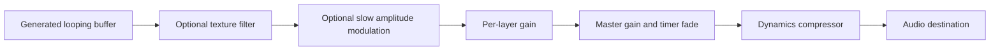

# Architecture

## Scope and choices

Use plain HTML, CSS, and ES modules. The starter does not need a framework, bundler, database, server-side account system, or paid service. Node is only a convenience for the development server and tests. All runtime assets are first-party static files.

`js/state.js` owns the catalog, defaults, presets, and input normalization. `app.js` owns UI state, event handlers, persistence, the timer deadline, and PWA registration. `js/audio.js` owns the audio graph and sound generation. `sw.js` caches the static shell. These boundaries allow a future recorded-audio engine without replacing the UI.

## Audio graph

The audio context is created in response to Play. Sources are created lazily when enabled, then retained for reuse and muted when deselected. Pausing suspends the context. Gain changes are smoothed to reduce clicks, and fixed mixing headroom reduces clipping risk. At six 12-second mono buffers and 48 kHz, sample storage is approximately 14 MB. Generated noise is nondeterministic between sessions. A brief boundary blend reduces endpoint discontinuities; perceived loop quality still needs listening tests.

Nature textures apply filters and, for ocean and wind, slow gain modulation. The current pink-noise approximation is deliberately simple. No clinical or calibrated-acoustic claims are made.

## State and persistence

The versioned `openambience.v1` localStorage key contains `{ mix, saved }`. A mix has `master` (0–100), `levels` keyed by known sound ID (0–100), and an `enabled` list. Unknown IDs are removed, invalid numeric values receive defaults, and values are clamped. Saved entries contain a name and normalized mix. Storage errors are recoverable; the session remains usable.

Playback state and timer deadlines are not persisted. Names are inserted as text, never interpreted as HTML. No server receives mixes. Reset clears only the current mix and timer; deleting a saved mix is a separate action.

## Timer

Changing the selected duration during playback restarts the countdown. Pause cancels the deadline; Play starts a new countdown for the selected duration. Master gain is scheduled to fade during the final five seconds on the audio clock, and a wall-clock check suspends playback when the deadline is reached. Visibility changes trigger an additional deadline check. Browser or OS audio suspension can interrupt these clocks; this is not a guaranteed alarm service.

## Offline and updates

The service worker atomically installs a versioned cache of the app shell and all runtime modules/icons. It serves that cache first and falls through to the network for uncached same-origin URLs within scope. It does not fetch remote audio or cache arbitrary network responses. Old OpenAmbience shell caches are removed on activation. New versions wait for open clients to close before replacing the current worker. Cache version bumps must accompany releases.

All asset and manifest paths are relative to support GitHub project Pages. HTTPS is required in production; localhost is suitable for development. Installability and background playback are distinct capabilities.

## Extension points

Add future recordings through a catalog that records file path, author, source, license, attribution, duration, and offline size. Load/decode them only on demand and design crossfades independently of the synthetic layer engine. Keep live streams opt-in and visibly network-dependent. Shareable mixes should use a versioned, validated schema and never imply shared access to someone else's local storage.
