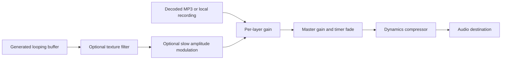

# Architecture

## Scope and choices

Use plain HTML, CSS, and ES modules. The starter does not need a framework, bundler, server-side account system, or paid service. Node is only a convenience for the development server and tests. Bundled assets are served locally; custom recordings live in IndexedDB.

`js/state.js` owns the catalog, defaults, presets, and input normalization. `app.js` owns UI state, event handlers, persistence, the timer deadline, and PWA registration. `js/audio.js` owns the audio graph and sound generation. `js/catalog.js` is generated from the recording credit register. `js/storage.js` owns IndexedDB transactions. `sw.js` caches the shell and bundled recordings.

## Audio graph

The audio context is created in response to Play. Sources are created and decoded lazily when enabled, then stopped and released when deselected. Updates are serialized so fast slider input cannot trigger concurrent full-buffer decodes. Up to six layers and 96 MiB of retained decoded audio are allowed; oversized mixes pause with a recoverable error. Pausing suspends the context. Gain changes are smoothed to reduce clicks, and fixed mixing headroom reduces clipping risk. A 30-second stereo recording uses approximately 11 MiB at 48 kHz. Thunder adds 30 seconds of silence between repeats, counted against the memory limit. The budget excludes transient decoder memory. Generated noise is nondeterministic between sessions. A brief boundary blend reduces endpoint discontinuities; perceived loop quality still needs listening tests.

Nature textures apply filters and, for ocean and wind, slow gain modulation. The current pink-noise approximation is deliberately simple. No clinical or calibrated-acoustic claims are made.

## State and persistence

The versioned `openambience.v2` localStorage key contains `{ schemaVersion: 2, mix, saved }`. If absent, legacy `openambience.v1` is read without deleting it. Original procedural IDs retain their meaning. Custom recordings have stable UUIDs and SHA-256 hashes; metadata and blobs commit together to the `sounds` IndexedDB store. The catalog is loaded before recipes are normalized. Removing a custom recording removes its references from local mixes. A mix has `master` (0–100), `levels` keyed by known sound ID (0–100), and an `enabled` list. Unknown IDs are removed, invalid numeric values receive defaults, and values are clamped. Saved entries contain a name and normalized mix. Storage errors are recoverable; the session remains usable.

Playback state and timer deadlines are not persisted. Names are inserted as text, never interpreted as HTML. No server receives mixes. Reset clears only the current mix and timer; deleting a saved mix is a separate action.

## Timer

Changing the selected duration during playback restarts the countdown. Pause cancels the deadline; Play starts a new countdown for the selected duration. Master gain is scheduled to fade during the final five seconds on the audio clock, and a wall-clock check suspends playback when the deadline is reached. Visibility changes trigger an additional deadline check. Browser or OS audio suspension can interrupt these clocks; this is not a guaranteed alarm service.

## Offline and updates

The service worker atomically installs a versioned cache of the app shell, all runtime modules/icons, credit register, and all twelve recordings. It serves that cache first and falls through to the network for uncached same-origin URLs within scope. It does not fetch remote audio or cache arbitrary network responses. Old OpenAmbience shell caches are removed on activation. New versions wait for open clients to close, or for the user to choose Update app (which pauses playback and activates the waiting worker). Cache version bumps must accompany releases.

All asset and manifest paths are relative to support GitHub project Pages. HTTPS is required in production; localhost is suitable for development. Installability and background playback are distinct capabilities.

## Extension points

Add more recordings through `audio/credits.json`, which records file path, author, source, license, attribution, duration, and offline size. Load/decode them only on demand and design crossfades independently of the synthetic layer engine. Keep live streams opt-in and visibly network-dependent. Shareable mixes should use a versioned, validated schema and never imply shared access to someone else's local storage.

## Categories and radio (0.3.0-alpha.1)

`js/categories.js` maps stable bundled IDs to display categories. Imports can carry a user-selected category while remaining discoverable in My sounds. A selected category is remembered separately in localStorage.

`js/radio.js` validates direct HTTPS URLs and manages one native media element per active station. Each element uses anonymous CORS and a `MediaElementAudioSourceNode` connected to the existing layer/master gains. The audio engine never fetches a whole live stream into a buffer. Errors and offline transitions disconnect the affected station while leaving local layers running; fifteen-second connection/buffering timeouts offer a manual retry. Pause and deselection release station connections.

Station records share the IndexedDB metadata store, with `kind: radio`, a stable ID, name, and URL. They have no audio blob. Existing recipes can refer to these IDs without a schema change. The service worker still caches only the explicitly bundled library. See [radio compatibility](internet-radio.md) and [the proposed sync model](sync-and-offline.md).
